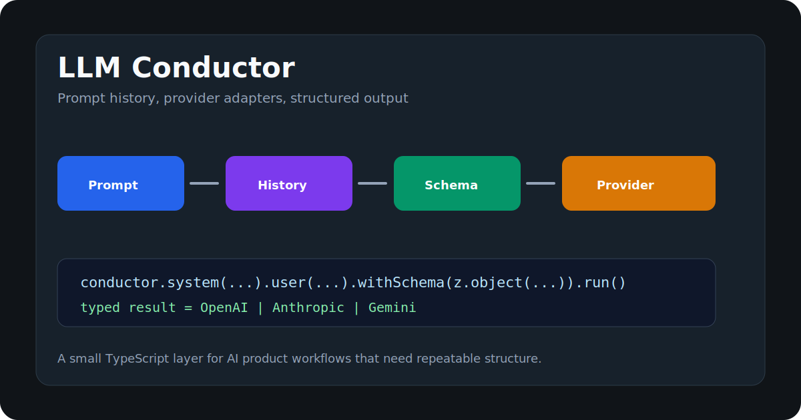

# LLM Conductor

Type-safe orchestration for text conversations across OpenAI, Anthropic, Gemini, and custom providers.



[Live website](https://llm-conductor-zrl4ko.v2.appdeploy.ai/) · [GitHub repository](https://github.com/onuracar-dev/llm-conductor)

LLM Conductor keeps a deliberately small API surface: compose a conversation, select a provider, optionally request structured output or tools, then run or stream it. It uses direct HTTP requests and has only one runtime dependency, Zod.

## What it provides

- Fluent `system().user().run()` API with conversation history
- OpenAI Chat Completions, Anthropic Messages, and Gemini Generate Content adapters
- Zod-validated structured output
- Normalized text, tool calls, token usage, finish reason, request ID, and raw provider data
- Normalized streaming events across all built-in providers
- Timeout, `AbortSignal`, exponential retry, jitter, and `Retry-After` support
- Custom `fetch`, API base URL, headers, and provider adapters
- ESM, CommonJS, and TypeScript declaration builds

## Install

```bash
npm install llm-conductor zod
```

Node.js 18 or newer is supported. Other runtimes must provide standards-compatible `fetch`, `AbortController`, `ReadableStream`, and `TextDecoder` implementations. Do not put provider API keys in browser-delivered code.

## Quick start

```ts
import { Conductor } from "llm-conductor";

const conductor = new Conductor({
  provider: "openai",
  apiKey: process.env.OPENAI_API_KEY ?? "",
  model: "your-approved-model",
});

const answer = await conductor
  .system("Answer precisely and say when you are uncertain.")
  .user("Explain why idempotency matters in APIs.")
  .run();

console.log(answer);
```

Always choose a model explicitly in production. `DEFAULT_MODELS` is exported and preserves the original v1 behavior when `model` is omitted, but provider model availability changes independently of this package.

## Results and metadata

`run()` remains the concise API and returns only content. Use `runWithMetadata()` when usage, tool calls, or provider-native data matters:

```ts
const response = await conductor.user("Give me one sentence.").runWithMetadata();

console.log(response.content);
console.log(response.usage?.totalTokens);
console.log(response.finishReason);
console.log(response.responseId);
console.log(response.requestId);
console.log(response.raw); // provider-native response; treat as unstable
```

`getLastResponse()` returns the latest normalized response without another request.

## Structured output

```ts
import { Conductor } from "llm-conductor";
import { z } from "zod";

const ReleaseNote = z.object({
  title: z.string(),
  changes: z.array(z.string()),
  breaking: z.boolean(),
});

const note = await new Conductor({
  provider: "anthropic",
  apiKey: process.env.ANTHROPIC_API_KEY ?? "",
  model: "your-approved-model",
})
  .user("Summarize the supplied release diff.")
  .withSchema(ReleaseNote)
  .run();

console.log(note.changes); // fully typed and runtime-validated
```

Malformed JSON and Zod mismatches throw a `ConductorError` with code `VALIDATION_ERROR`. JSON Schema support is limited by both Zod's converter and the selected provider's supported JSON Schema subset.

## Streaming

All built-in adapters expose the same event union:

```ts
const conductor = new Conductor({
  provider: "gemini",
  apiKey: process.env.GEMINI_API_KEY ?? "",
  model: "your-approved-model",
}).user("Write a short greeting.");

for await (const event of conductor.stream()) {
  if (event.type === "text_delta") process.stdout.write(event.delta);
  if (event.type === "tool_call_delta") process.stdout.write(event.argumentsDelta);
  if (event.type === "usage") console.log(event.usage);
  if (event.type === "done") console.log(event.response);
}
```

The final `done` event contains the accumulated, validated response and commits it to conversation history. If iteration is cancelled before `done`, the partial response is not added to history. Mid-stream failures are not retried because replaying a partially delivered response is unsafe.

## Tool calls

LLM Conductor declares tools and normalizes provider tool calls; it intentionally does not execute application code automatically.

```ts
import { Conductor } from "llm-conductor";
import { z } from "zod";

const conductor = new Conductor({
  provider: "openai",
  apiKey: process.env.OPENAI_API_KEY ?? "",
  model: "your-approved-model",
})
  .user("What is the weather in Istanbul?")
  .withTools([{
    name: "get_weather",
    description: "Read current weather for a city",
    parameters: z.object({ city: z.string() }),
  }]);

const first = await conductor.runWithMetadata();
for (const call of first.toolCalls ?? []) {
  if (call.name === "get_weather") {
    const result = await getWeather(call.arguments);
    conductor.toolResult(call, result);
  }
}

const finalAnswer = await conductor.run();
```

Tool argument JSON that cannot be parsed is preserved as a string in `call.arguments` and in `call.argumentsText`; validate it before execution. Structured output and user tool calls are intentionally separate operations in the portable API.

Provider-required opaque tool metadata (for example, Gemini thought signatures) is retained on `call.providerMetadata` and replayed when the call remains in Conductor-managed history. Do not strip it when reconstructing history yourself.

## Reliability controls

```ts
const controller = new AbortController();

const conductor = new Conductor({
  provider: "openai",
  apiKey: process.env.OPENAI_API_KEY,
  model: "your-approved-model",
  timeoutMs: 20_000, // per attempt
  retry: {
    maxRetries: 2,
    initialDelayMs: 250,
    maxDelayMs: 4_000,
    backoffMultiplier: 2,
    jitter: true,
  },
});

await conductor.user("Hello").run({ signal: controller.signal });
```

By default, retryable network failures and HTTP 408, 409, 425, 429, 500, 502, 503, and 504 responses are retried twice. `Retry-After` is honored up to `maxDelayMs`. Authentication, permission, validation, and caller-abort errors are not retried.

## Gateways and custom fetch

```ts
const conductor = new Conductor({
  provider: "openai",
  apiKey: process.env.GATEWAY_TOKEN ?? "",
  model: "gateway-model",
  baseURL: "https://llm-gateway.example.com/v1",
  headers: { "x-tenant-id": "team-42" },
  fetch: instrumentedFetch,
});
```

Request-level `model`, `temperature`, `maxTokens`, `headers`, timeout, retry, tools, and signal values can be passed to `run()`, `runWithMetadata()`, or `stream()` and override constructor defaults.

## Custom providers

```ts
import type { LLMProvider } from "llm-conductor";
import { Conductor } from "llm-conductor";

const localProvider: LLMProvider = {
  name: "local",
  async chat(messages) {
    const content = await callLocalModel(messages);
    return { content, raw: { transport: "local" } };
  },
};

const conductor = new Conductor({ provider: localProvider });
```

The fourth adapter argument receives request-level options. Existing adapters implementing the original three-argument `chat(messages, options, schema)` contract remain compatible. Streaming is optional for custom adapters.

## Errors

Every library-owned failure is a `ConductorError`:

```ts
import { ConductorError } from "llm-conductor";

try {
  await conductor.run();
} catch (error) {
  if (error instanceof ConductorError) {
    console.error(error.code, error.status, error.requestId, error.retryable);
  }
}
```

Codes distinguish configuration, authentication, permission, rate limiting, request validation, timeout, cancellation, network, malformed provider response, schema validation, stream, and unsupported-feature failures. `details` may contain provider error payloads; review it before logging in sensitive environments.

## Provider scope

| Provider | HTTP API used | Text | Structured output | Tools | Streaming |
| --- | --- | ---: | ---: | ---: | ---: |
| OpenAI | Chat Completions | Yes | Yes | Yes | Yes |
| Anthropic | Messages | Yes | Yes, via forced formatter tool | Yes | Yes |
| Gemini | Generate Content | Yes | Yes | Yes | Yes |
| Custom | Adapter-defined | Yes | Adapter-defined | Adapter-defined | Optional |

The package is a lightweight portability layer, not a replacement for full provider SDKs. It currently does not model multimodal content, embeddings, image/audio generation, batch APIs, hosted/server-side tools, reasoning/thinking blocks, OpenAI's Responses API, Gemini's Interactions API, provider-specific safety settings, or automatic tool execution. Use a custom adapter when those features are central to your application.

## Security

- Use this package on a trusted server; never ship provider credentials to an untrusted browser.
- Validate tool arguments and authorize every tool invocation before executing it.
- Treat prompt content, provider errors, and `raw` responses as potentially sensitive.
- A timeout cannot guarantee that a provider stopped server-side processing or billing after the client disconnected.
- See [SECURITY.md](./SECURITY.md) for vulnerability reporting and the support policy.

## Development

```bash
npm ci
npm run check
npm pack --dry-run
npm audit
```

Tests use HTTP and SSE mocks; they do not spend provider credits or require real API keys. See [CONTRIBUTING.md](./CONTRIBUTING.md) before proposing a change.

## License

MIT © Onur Acar. See [LICENSE](./LICENSE).
